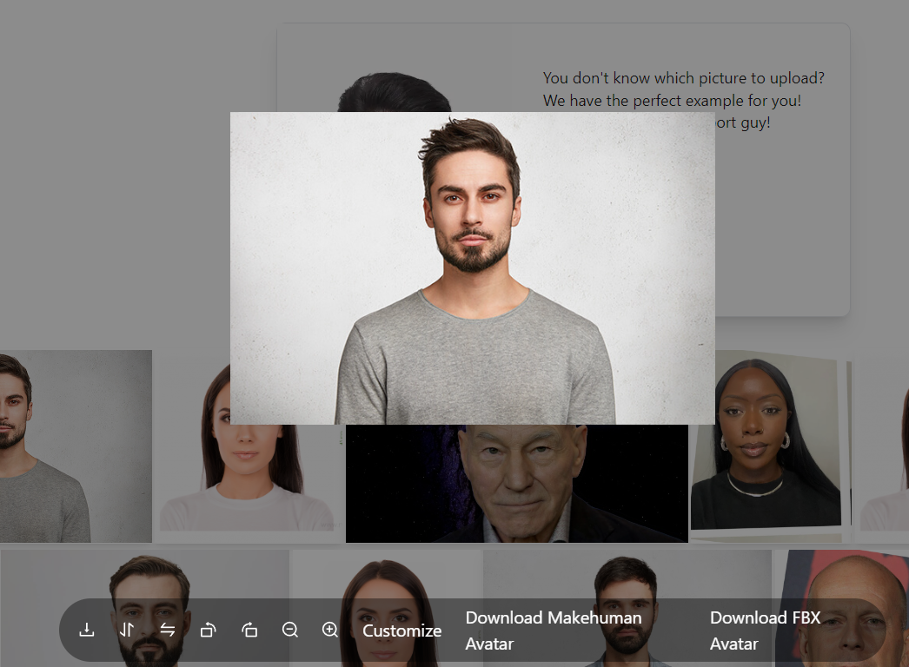
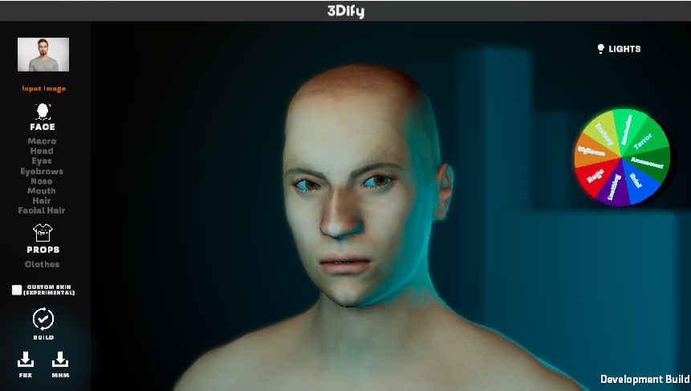
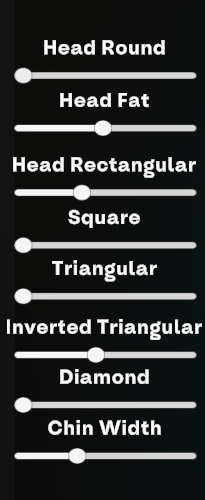
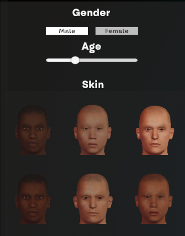
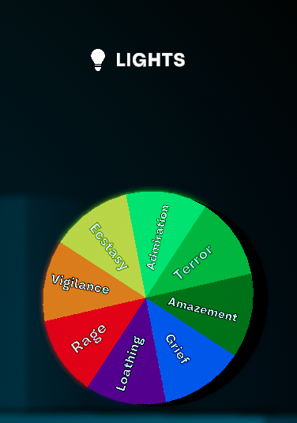
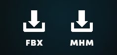

# Submission are closed

**3Dify** is an application for creating 3D avatars from a single image. In this hackathon, participants will use 3Dify to create the best avatars possible and compete for first place. The final winner will receive a Meta Quest 3.

Checkout the poster of the Hackathon at the following [link](hackathon_poster).

## Prerequisites

### Windows
For executing on Windows Systems it is necessary to install beforehand an X11 Server, we advise **VcXsrv Windows X Server** that can be found at the following [link](https://sourceforge.net/projects/vcxsrv/), as well as **Docker Desktop** at the following [link](https://www.docker.com/products/docker-desktop/).

If when opening Docker Desktop should appear an error mentioning WSL open the command prompt and type:
```bash
wsl --update
```

The following are the preliminary steps for executing only for Windows Systems.

1. After having installed VcXsrv proceed to open with **XLaunch** 
2. Select **Multiple Windows** and specify 1 as **Display number**
3. Select **Start no client**
4. Ensure that **Disable access control** is checked
5. Click **Finish**
6. Open **Docker Desktop**
7. Proceed with the instruction for the launch with Docker Compose specified below.

### Linux
For executing on Linux Systems it is just necessary to install **Docker Engine** by following the guide for your distro at the following [link](https://docs.docker.com/engine/). (**ATTENTION** Currently this version only work by using Docker Engine with sudo command and is not compatible with Docker Desktop for linux systems.)

The following are the preliminary steps for executing only for Linux Systems after having installed Docker Engine.

1. Open the terminal (Restart it if is the same terminal from which you have just installed Docker engine) and type:.
```bash
xhost +local:docker
```
2. Proceed with the instruction for the launch with Docker Compose specified below.
   
### MacOs
For executing on MacOs Systems is necessary to install both an X11 server, we advise **XQuartz** downloadable from the following [link](https://www.xquartz.org/) and **Docker Desktop**, downloadable from the following [link](https://www.docker.com/products/docker-desktop/).

(**DISCLAIMER**: Currently on Apple Silicon Processors the software may present some slow down due to the translation layer from x64 to ARM.)

1. After having installed **XQuartz** proceed to open it.
2. Open a terminal and type:
```bash
      xhost +local:docker
      xhost + 127.0.0.1
```
3. Open the **docker-compose.yml** and comment the following line:
```bash
      - DISPLAY=${DISPLAY:-host.docker.internal:1}
```
4. And remove the comment from the following line:
```bash
      # - DISPLAY=host.docker.internal:0
```
5. Proceed with the instruction for the launch with Docker Compose specified below.

## Launch
Download the Docker Compose file [here](https://github.com/isislab-unisa/3dify/blob/main-no-auth/docker-compose.yml).

Launch all the containers required to run the application inside the directory where the compose file has been downloaded:

```bash
docker compose up -d
```

Stop all the containers of the application:

```bash
docker compose down
```

If the application is correctly deployed, it can be run by default at the link [http://localhost:3000/](http://localhost:3000/).

## Avatar Creation Guide
Firstly you'll be redirected to the main page of the application


Once here you just need to select a picture by using the picker in the page, and once the picture has been uploaded just click on it and a submenu will appear.



To start creating the avatar select the "Customize" option and a new window will open.



Here will appear the avatar generated by the app, with options to change any of the value calcolated, as well as options for adding clothes, hair, facial hair and a custom skin extracted by the input image.

 

For any change made to the avatar before it will be visible it'll have to be rebuild by clicking on the button **BUILD** in the main interface.



To better check any modification done, the software give some options for the visualization.
By clicking on the **LIGHT** button the software will cycle between four different preset of light in order to observe the avatar in various condition, and by clicking on any slice of the Pie Chart it will play an animation associated to the emotion written to check the avatar in motion.



Once done with the customization of the avatar, for submitting it, you will have to export it as FBX by clicking on the corresponding button as above illustrated.

## Video Tutorial

Please watch the video below for a tutorial on creating your first avatar.

[](https://www.youtube.com/watch?v=rxa-XgzOe4o)

## Submission
**Submission are closed**.

For submitting your personalized avatar you will firstly have to submit your answers to an evalutation questionnaire about the software you have just used at the following [link]().

Once done with the questionnaire you will receive a One Time Code that you will need to submit you avatar at the following [link]().
In the avatar submission form you will be asked for your original input Image, a .zip archive containing the exported .FBX from the software and the One Time Code that you will have received previously.


## Contacts

To read more about the software you can follow up at the following [link](https://isislab-unisa.github.io/3dify/)

If you need any help or technical support you can contact damonaco@unisa.it

3Dify is part of the [SERMAS project](https://sermasproject.eu/) 


